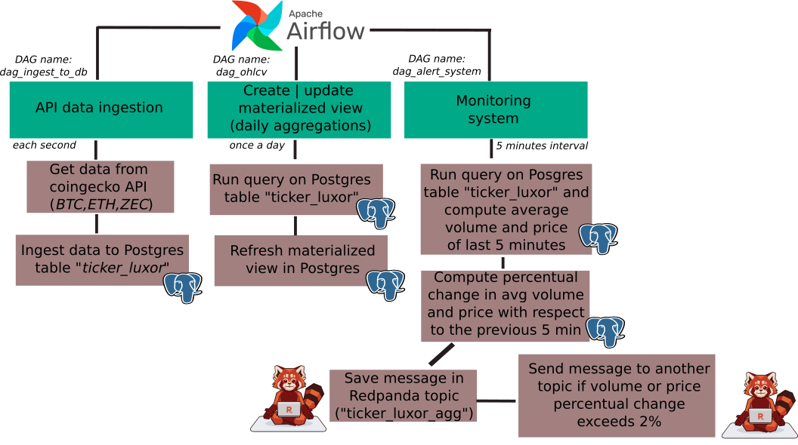

**Luxor Data Engineer Coding Challenge**

To resolve the challenge, we created a Docker Compose with Apache Airflow, Postgres, and Redpanda as services to facilitate the orchestration, storage, and data processing. An Airflow DAG was created for each of the following components of our application: 

1. **Data Ingestion**

    - **DAG name:** <i>ingest_data</i>. The DAG is executed every 5 minutes.
    - **CoinGecko API**: We implemented a task in the DAG that calls the API once per second for each ticker (BTC, ETH, ZEC).
    - **Postgres Table**: We created a database ('tickers_db') and table ('luxor_data') where we continuously ingest the retrieved data from the API.

2. **Materialized View**

    - **DAG name:** <i>create_materialized_view</i>. This DAG is executed every 24 hs.
    - For the daily OHLCV (Open, High, Low, Close, Volume) materialized view, the DAG processes and aggregates the metrics of interest (price and volume) every 24 hours.

3. **Monitoring and Alerts**

    - **DAG name:** <i>monitoring_system</i>. This DAG is executed every 5 minutes.
    - **Redpanda**: We leveraged Redpanda to create a real-time alert flow based on mean price or volume changes in the last 5 minutes. First, the avg_price and avg_volume is computed for the data from the last 5 minutes, along with the percent change in price and volume with respect to the previous 5 minutes. This data is stored as messages in a Redpanda topic called "tickers_agg_luxor".
    - **Push-based Alerts**: When the percetual change in volume or price exceeds the 2%, we publish a message to a specific Redpanda topic ("tickers_agg_luxor_price_anomalies" or "tickers_agg_luxor_volume_anomalies").

**Architecture Diagram**

- **Data source**: CoinGecko API.
- **Ingestion & Transformation**: Apache Airflow to orchestrate the ingestion and necessary transformations.
- **Storage**: Postgres to store both real-time data and the materialized view with daily aggregations.
- **Processing & Output**: Redpanda to emit real-time alerts and handle price/volume change events.

**Extensibility**
- We can add other tickers simply by adding them to the Airflow DAG. For other metrics or purposes, we could modify the processing tasks to calculate other financial indicators (e.g., RSI, Moving Averages).

**Scalability**
- An option to optimize retrieval speed could be the integration of a Clickhouse DB, i.e., a columnar database. The Clickhouse db could serve as a speed-up layer. ClickHouse stores data by columns rather than rows. This allows for efficient compression and faster data retrieval, especially for analytical queries that often involve aggregations and filters on specific columns. In addition, it provides vectorized query execution, processing data in batches, using vectorized execution to enhance CPU usage and significantly speed up query performance.

- If we need to scale query processing beyond what PostgreSQL can offer on its own (in terms of parallelism workload distribution, etc.), then Trino could provide the capability to distribute queries across multiple nodes.
- Partitioning: We could use table partitioning to split your data based on time or asset type. For example:a) range partitioning by time to split the data by month or week. This way, queries can focus only on the relevant partitions instead of scanning the entire dataset. b) List partitioning by asset, storing different assets in different partitions, and thus reducing the volume per partition and improving query performance.
- Indexing: create indices on frequently queried fields.
- Archiving old data: we can move less frequently accessed data to a separate table or a different storage layer, like S3 or a data lake, and keep only recent data in the active table.
- Horizontal scaling: we can consider using a read-replica setup with <i>PostgreSQL replication</i>. This allows for distributing read queries to replicas, reducing load on the primary database.

By combining some of the above mentioned alternatives, we can scale PostgreSQL effectively while maintaining high retrieval speeds.

<b> Instructions to run the app: </b>

- You can start the app either locally in your computer or in a github codespace.
In either case, you just have to run <i>docker-compose up</i> to run all the services.

- To access the Apache Airflow UI to visualize all the DAGs and proceses, enter to http://localhost:9001

- To access the Redpanda UI to inspect the topics, enter to http://localhost:8080

- Finally, you can visualize and query the Postgres database and tables using the PGAdmin UI, accesible at (http://localhost:8083). Another alternative to inspect the postgres db and tables is to access the container (<i>docker exec -it luxor-tech_postgres_1 /bin/bash</i>) and then entering to the DB (<i>\psql -U airflow -d tickers_db</i>). 

